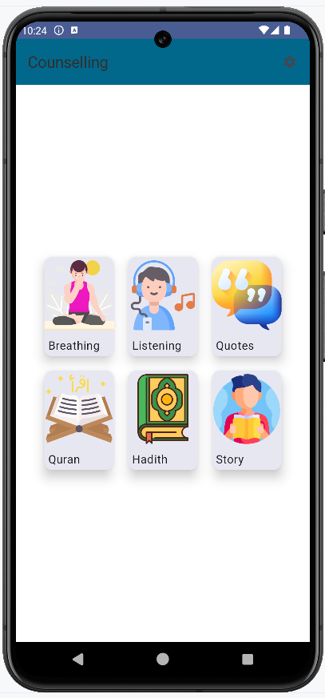
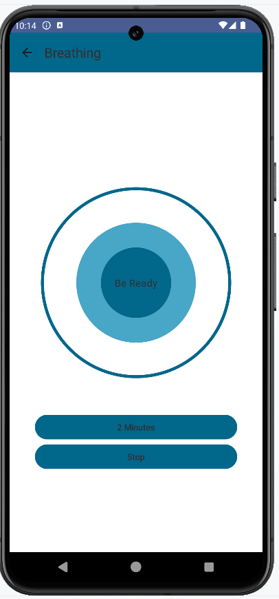
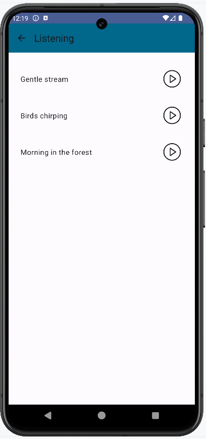
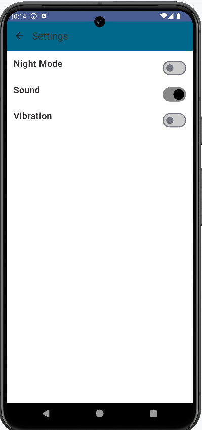
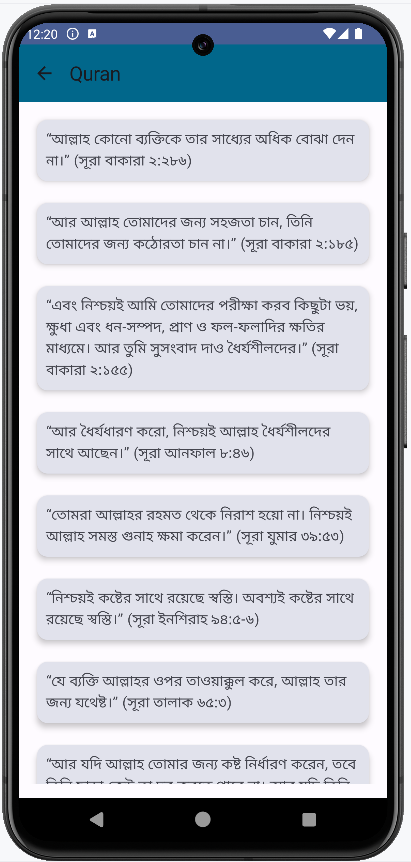
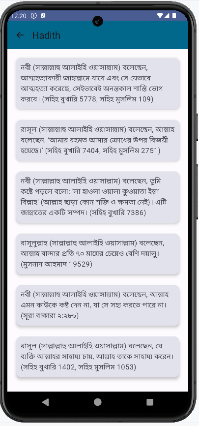

# 🌿 Counselling App

**Counselling App** is an Android application built to support mental and emotional well-being. It provides a calming and organized interface with various helpful features like breathing exercises, soothing sounds, quotes, and spiritual content. Designed with simplicity and accessibility in mind, the app is a gentle companion for anyone in need of peace, reflection, or inspiration.

---

## 🧠 Overview

The app offers several mental wellness tools, including:
- Guided breathing sessions
- Relaxing audio (nature sounds, birds chirping, etc.)
- Motivational quotes
- Islamic content like Quranic verses and Hadith
- Uplifting moral stories

---

## ✨ Features

- 🧘 **Breathing**: Calming breathing exercises to reduce stress.
- 🎵 **Listening**: Meditation music, water sounds, bird chirping, and more.
- 💬 **Quotes**: Daily motivational quotes to inspire users.
- 📖 **Quran**: Selected verses for spiritual reflection.
- 📜 **Hadith**: Moral and spiritual guidance through Hadiths.
- 📘 **Story**: Uplifting stories with emotional and moral messages.

---

## 🛠️ Tech Stack

- **Language**: Kotlin  
- **UI Framework**: Jetpack Compose  
- **IDE**: Android Studio  
- **Architecture**: MVVM (optional)

---

## 🖼️ Screenshots

| Home | Breathing | Listening |
|------|-----------|-----------|
|  |  |  |

| Settings | Quran | Hadith |
|--------|-------|--------|
|  |  |  |

---

## 🚀 Getting Started

1. Clone the repository:
   ```bash
   git clone https://github.com/yourusername/CounsellingApp.git

## 🤝 Contributing
This project is currently under development. Contributions, feedback, and ideas are welcome!

## 📧 Contact

**Md Rasel Rahman**  
📍 Jashore, Bangladesh  
📫 [LinkedIn](https://www.linkedin.com/in/rasel093/) | [GitHub](https://github.com/rasel-093)
---
